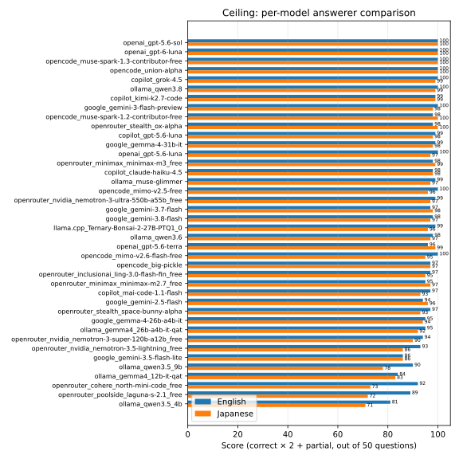

# bou-thakuranir_haat

Tagore's Bengali novel "Bou-Thakuranir Haat"
([বৌ-ঠাকুরাণীর হাট](https://bn.wikipedia.org/wiki/%E0%A6%AC%E0%A7%8C-%E0%A6%A0%E0%A6%BE%E0%A6%95%E0%A7%81%E0%A6%B0%E0%A6%BE%E0%A6%A3%E0%A7%80%E0%A6%B0_%E0%A6%B9%E0%A6%BE%E0%A6%9F))
and its translations.

**[Read online](https://7shi.github.io/bou-thakuranir_haat/)** — the novel split by chapter with a language switcher (original / modern Bengali / English / Japanese), plus the [QA list](https://7shi.github.io/bou-thakuranir_haat/qa-en.html) linked to the chapters it references.

> [!NOTE]
> All translations in this repository are machine-generated (Gemini 2.5 Pro) and have not been reviewed or corrected by a human translator.
> Errors and mistranslations are present throughout.
> These files are provided as-is for reference and study purposes only.

## Original

The original text is written in classical (Sadhu) Bengali — an older literary form distinct from modern spoken Bengali.
See language analysis: [English](docs/bhasha-en.md) / [Japanese](docs/bhasha-ja.md)

file|description
----|----
[all/bn.md](all/bn.md) | original Bengali text from [Wikisource](https://bn.wikisource.org/wiki/%E0%A6%AC%E0%A7%8C-%E0%A6%A0%E0%A6%BE%E0%A6%95%E0%A7%81%E0%A6%B0%E0%A6%BE%E0%A6%A3%E0%A7%80%E0%A6%B0_%E0%A6%B9%E0%A6%BE%E0%A6%9F/%E0%A6%AA%E0%A7%8D%E0%A6%B0%E0%A6%A5%E0%A6%AE_%E0%A6%AA%E0%A6%B0%E0%A6%BF%E0%A6%9A%E0%A7%8D%E0%A6%9B%E0%A7%87%E0%A6%A6)

The following files provide a modern Bengali retelling generated by Gemini 2.5 Pro to make the text more accessible to contemporary readers.

file|description
----|----
[all/bn-gemini.md](all/bn-gemini.md) | modern Bengali translation from classical Bengali by Gemini 2.5 Pro
[all/bn-gemini-summary.md](all/bn-gemini-summary.md) | modern Bengali translation summary by Gemini 2.5 Pro
[all/bn-gemini.jsonl](all/bn-gemini.jsonl) | per-segment modern Bengali translation data (summary, notes, translation) by Gemini 2.5 Pro in JSONL

### English Translation

file|description
----|----
[all/en-gemini.md](all/en-gemini.md) | English translation from Bengali by Gemini 2.5 Pro
[all/en-gemini-full.md](all/en-gemini-full.md) | English translation with summaries and translation notes by Gemini 2.5 Pro
[all/en-gemini-summary.md](all/en-gemini-summary.md) | per-segment English summaries by Gemini 2.5 Pro
[all/en-gemini-lines.md](all/en-gemini-lines.md) | English translation with one sentence per line by Gemini 2.5 Pro
[all/en-gemini.jsonl](all/en-gemini.jsonl) | per-segment English translation data (summary, notes, translation) by Gemini 2.5 Pro in JSONL
[all/en-gemini.tsv](all/en-gemini.tsv) | per-segment English scene titles in TSV

### Japanese Translation

file|description
----|----
[all/ja-gemini.md](all/ja-gemini.md) | Japanese translation from Bengali by Gemini 2.5 Pro
[all/ja-gemini-full.md](all/ja-gemini-full.md) | Japanese translation with summaries and translation notes by Gemini 2.5 Pro
[all/ja-gemini-summary.md](all/ja-gemini-summary.md) | per-segment Japanese summaries by Gemini 2.5 Pro
[all/ja-gemini-lines.md](all/ja-gemini-lines.md) | Japanese translation with one sentence per line by Gemini 2.5 Pro
[all/ja-gemini.jsonl](all/ja-gemini.jsonl) | per-segment Japanese translation data (summary, notes, translation) by Gemini 2.5 Pro in JSONL

### Hindi Translation

The Gemini translations are generated from the original Bengali.
The chapter translation (`xx-hi.md`) is sourced from a Hindi print edition via [archive.org](https://archive.org/details/dli.ernet.526165).

file|description
----|----
[all/hi-gemini.md](all/hi-gemini.md) | Hindi translation from Bengali by Gemini 2.5 Pro
[all/hi-gemini-full.md](all/hi-gemini-full.md) | Hindi translation with summaries and translation notes by Gemini 2.5 Pro
[all/hi-gemini-summary.md](all/hi-gemini-summary.md) | per-segment Hindi summaries by Gemini 2.5 Pro
[all/hi-gemini.jsonl](all/hi-gemini.jsonl) | per-segment Hindi translation data (summary, notes, translation) by Gemini 2.5 Pro in JSONL
[chapters/01-hi.md](chapters/01-hi.md) | Hindi translation (Chapter 1) from [archive.org](https://archive.org/details/dli.ernet.526165)

## Line alignment

The source has one line per line of dialogue or narration, but the translation JSONLs above store each scene as a single flowing paragraph, so that structure is lost.
[all/aligned/](all/aligned/) holds the same translations with the line breaks put back — not a re-translation and not a proofreading pass.
The files there are deltas against the JSONLs above and need unpacking; see [all/aligned/README.md](all/aligned/README.md) for the method, the model comparison and the checks.

All four `.md` files above are built from the aligned text: `make convert` unpacks the deltas and substitutes their translations into the JSONLs, which keep the summaries and translation notes.
The JSONLs themselves are unchanged, and [qa-eval/](qa-eval/README.md) still evaluates against them.

## Docs

Analysis and reference documents for the novel.

file|description
----|----
[docs/bhasha-en.md](docs/bhasha-en.md) | Bengali language (Sadhu bhasha) analysis in English
[docs/bhasha-ja.md](docs/bhasha-ja.md) | Bengali language (Sadhu bhasha) analysis in Japanese
[docs/shadhu-en.md](docs/shadhu-en.md) | Close reading of Shadhu Bhasha vs. modern Bengali (Chapter 1) in English
[docs/shadhu-ja.md](docs/shadhu-ja.md) | Close reading of Shadhu Bhasha vs. modern Bengali (Chapter 1) in Japanese
[docs/flow-en.md](docs/flow-en.md) | Story flow diagram in English
[docs/flow-ja.md](docs/flow-ja.md) | Story flow diagram in Japanese

## Others

Miscellaneous files generated from the translations.

file|description
----|----
[claude-log.md](claude-log.md) | Summary from English by [Anthropic Claude](https://claude.ai/)
[chapters/01-tts.txt](chapters/01-tts.txt) | Text with translation juxtaposed for TTS (Chapter 1)
[segmentations.jsonl](segmentations.jsonl) | Bengali text segmentation data generated by Gemini 2.5 Pro
[questions-en.jsonl](questions-en.jsonl) | RAG evaluation questions (25 single-passage + 25 cross-reference) generated from the English translation
[questions-ja.jsonl](questions-ja.jsonl) | Japanese translation of [questions-en.jsonl](questions-en.jsonl)
[images.md](images.md) | Image generation prompts for illustrations

## Tools

Scripts used to process and generate the files in this repository.

directory|description
---------|----
[proper_nouns/](proper_nouns/) | corpus-wide proper-noun dictionary and the survey/anchor pipeline that builds it
[scripts/](scripts/) | translation, segmentation, and conversion scripts
[templates/](templates/) | site templates, plus build and deploy instructions
[wikisource/](wikisource/) | Wikisource scraping and text extraction tools

## QA evaluation

[qa-eval/](qa-eval/) evaluates retrieval strategies for answering questions about the novel — vector search, BM25, hybrid union, LLM-as-retriever filtering, per-chapter extraction, and GraphRAG — plus a per-model comparison of answerer models under a fixed context. See [qa-eval/README.md](qa-eval/README.md) for the full writeup.

**Per-model answerer comparison** ([qa-eval/results/README.md](qa-eval/results/README.md)): ceiling score (gold chapters as context, byte-identical across models) per model, English vs. Japanese.

