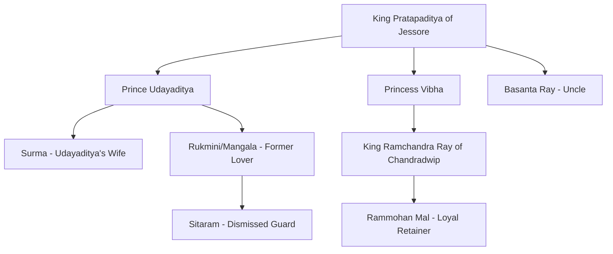
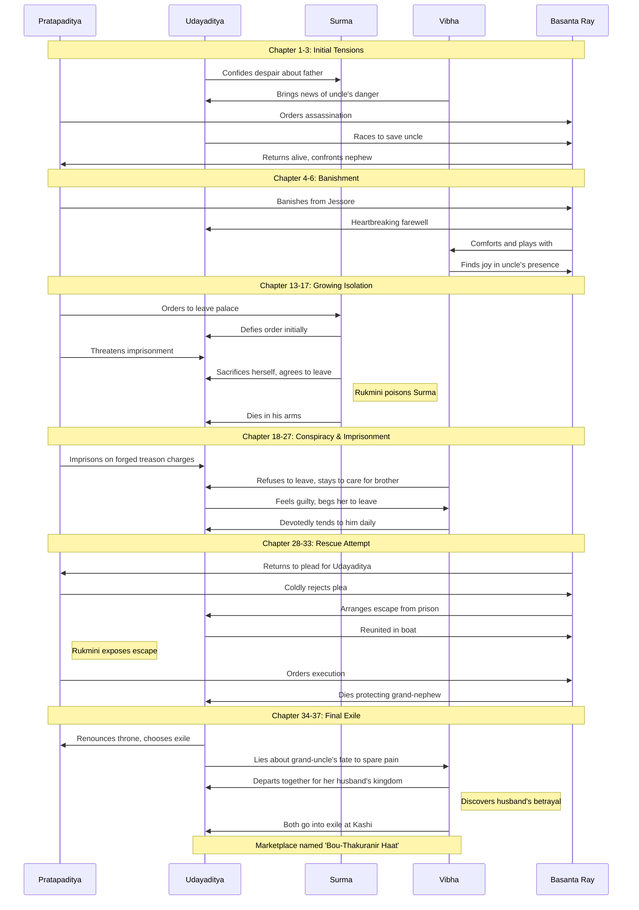
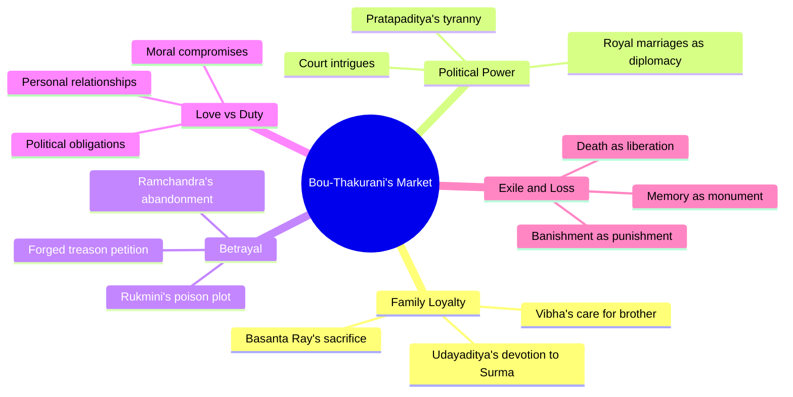

# Bou-Thakurani's Market - Story Flow

## Main Character Relationships

```mermaid
graph TD
    A[King Pratapaditya of Jessore] --> B[Prince Udayaditya]
    A --> C[Princess Vibha]
    B --> E[Surma - Udayaditya's Wife]
    C --> F[King Ramchandra Ray of Chandradwip]
    F --> G[Rammohan Mal - Loyal Retainer]
    A --> H[Basanta Ray - Uncle]
    B --> I[Rukmini/Mangala - Former Lover]
    I --> J[Sitaram - Dismissed Guard]
```

## Story Sequence

```mermaid
sequenceDiagram
    participant P as Pratapaditya
    participant U as Udayaditya
    participant S as Surma
    participant V as Vibha
    participant B as Basanta Ray

    Note over P,B: Chapter 1-3: Initial Tensions
    U->>S: Confides despair about father
    V->>U: Brings news of uncle's danger
    P->>B: Orders assassination
    U->>B: Races to save uncle
    B->>P: Returns alive, confronts nephew
    
    Note over P,B: Chapter 4-6: Banishment
    P->>B: Banishes from Jessore
    B->>U: Heartbreaking farewell
    B->>V: Comforts and plays with
    V->>B: Finds joy in uncle's presence
    
    Note over P,B: Chapter 13-17: Growing Isolation
    P->>S: Orders to leave palace
    S->>U: Defies order initially
    P->>U: Threatens imprisonment
    S->>U: Sacrifices herself, agrees to leave
    Note right of S: Rukmini poisons Surma
    S->>U: Dies in his arms
    
    Note over P,B: Chapter 18-27: Conspiracy & Imprisonment
    P->>U: Imprisons on forged treason charges
    V->>U: Refuses to leave, stays to care for brother
    U->>V: Feels guilty, begs her to leave
    V->>U: Devotedly tends to him daily
    
    Note over P,B: Chapter 28-33: Rescue Attempt
    B->>P: Returns to plead for Udayaditya
    P->>B: Coldly rejects plea
    B->>U: Arranges escape from prison
    U->>B: Reunited in boat
    Note right of P: Rukmini exposes escape
    P->>B: Orders execution
    B->>U: Dies protecting grand-nephew
    
    Note over P,B: Chapter 34-37: Final Exile
    U->>P: Renounces throne, chooses exile
    U->>V: Lies about grand-uncle's fate to spare pain
    V->>U: Departs together for her husband's kingdom
    Note right of V: Discovers husband's betrayal
    V->>U: Both go into exile at Kashi
    
    Note over U,V: Marketplace named 'Bou-Thakuranir Haat'
```

## Key Themes Flow

```mermaid
mindmap
    root((Bou-Thakurani's Market))
        Family Loyalty
            Udayaditya's devotion to Surma
            Vibha's care for brother
            Basanta Ray's sacrifice
        Political Power
            Pratapaditya's tyranny
            Court intrigues
            Royal marriages as diplomacy
        Betrayal
            Rukmini's poison plot
            Forged treason petition
            Ramchandra's abandonment
        Love vs Duty
            Personal relationships
            Political obligations
            Moral compromises
        Exile and Loss
            Banishment as punishment
            Death as liberation
            Memory as monument
```