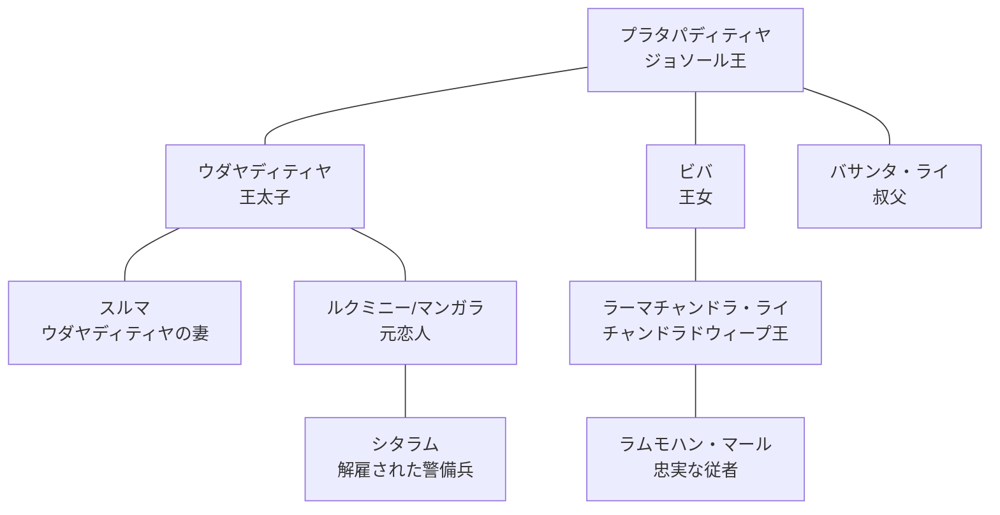
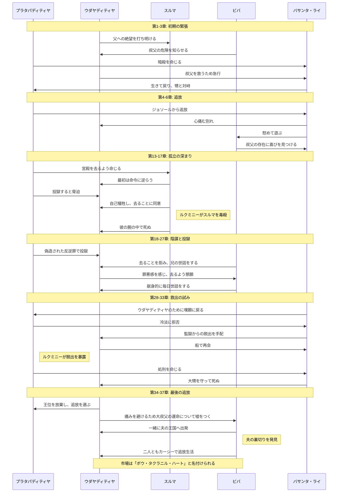
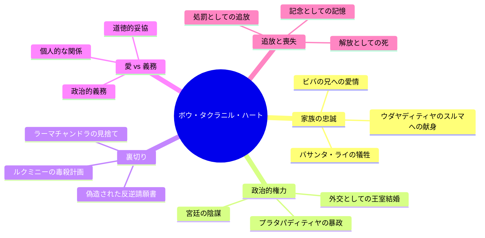

# ボウ・タクラニル・ハート - ストーリーフロー

## 主要人物関係図

```mermaid
graph TD
    A[プラタパディティヤ<br>ジョソール王] --- B[ウダヤディティヤ<br>王太子]
    A --- C[ビバ<br>王女]
    B --- E[スルマ<br>ウダヤディティヤの妻]
    C --- F[ラーマチャンドラ・ライ<br>チャンドラドウィープ王]
    F --- G[ラムモハン・マール<br>忠実な従者]
    A --- H[バサンタ・ライ<br>叔父]
    B --- I[ルクミニー/マンガラ<br>元恋人]
    I --- J[シタラム<br>解雇された警備兵]
```

## ストーリーシーケンス

```mermaid
sequenceDiagram
    participant P as プラタパディティヤ
    participant U as ウダヤディティヤ
    participant S as スルマ
    participant V as ビバ
    participant B as バサンタ・ライ

    Note over P,B: 第1-3章: 初期の緊張
    U->>S: 父への絶望を打ち明ける
    V->>U: 叔父の危険を知らせる
    P->>B: 暗殺を命じる
    U->>B: 叔父を救うため急行
    B->>P: 生きて戻り、甥と対峙
    
    Note over P,B: 第4-6章: 追放
    P->>B: ジョソールから追放
    B->>U: 心痛む別れ
    B->>V: 慰めて遊ぶ
    V->>B: 叔父の存在に喜びを見つける
    
    Note over P,B: 第13-17章: 孤立の深まり
    P->>S: 宮殿を去るよう命じる
    S->>U: 最初は命令に逆らう
    P->>U: 投獄すると脅迫
    S->>U: 自己犠牲し、去ることに同意
    Note right of S: ルクミニーがスルマを毒殺
    S->>U: 彼の腕の中で死ぬ
    
    Note over P,B: 第18-27章: 陰謀と投獄
    P->>U: 偽造された反逆罪で投獄
    V->>U: 去ることを拒み、兄の世話をする
    U->>V: 罪悪感を感じ、去るよう懇願
    V->>U: 献身的に毎日世話をする
    
    Note over P,B: 第28-33章: 救出の試み
    B->>P: ウダヤディティヤのために嘆願に戻る
    P->>B: 冷淡に拒否
    B->>U: 監獄からの脱出を手配
    U->>B: 船で再会
    Note right of P: ルクミニーが脱出を暴露
    P->>B: 処刑を命じる
    B->>U: 大甥を守って死ぬ
    
    Note over P,B: 第34-37章: 最後の追放
    U->>P: 王位を放棄し、追放を選ぶ
    U->>V: 痛みを避けるため大叔父の運命について嘘をつく
    V->>U: 一緒に夫の王国へ出発
    Note right of V: 夫の裏切りを発見
    V->>U: 二人ともカーシーで追放生活
    
    Note over U,V: 市場は「ボウ・タクラニル・ハート」と名付けられる
```

## 主要テーマフロー

```mermaid
mindmap
    root((ボウ・タクラニル・ハート))
        家族の忠誠
            ウダヤディティヤのスルマへの献身
            ビバの兄への愛情
            バサンタ・ライの犠牲
        政治的権力
            プラタパディティヤの暴政
            宮廷の陰謀
            外交としての王室結婚
        裏切り
            ルクミニーの毒殺計画
            偽造された反逆請願書
            ラーマチャンドラの見捨て
        愛 vs 義務
            個人的な関係
            政治的義務
            道徳的妥協
        追放と喪失
            処罰としての追放
            解放としての死
            記念としての記憶
```