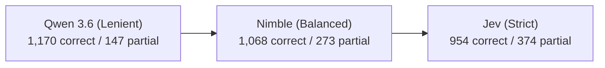

# Re-grading with Nimble

Every answer file in `results-en/` and `results-ja/` (15 methods × 50 questions
per language = 1,500 requests in total) was re-graded with Bespoke Labs'
**[Nimble](https://ollama.com/library/nimble)** (hosted locally via Ollama) and
compared with the existing **`ollama:qwen3.6`** verdicts and TypeSafe's **Jev**
(`jev-1.13.0`). For the multi-model comparison across 40 models in `results/`,
see [results/NIMBLE.md](results/NIMBLE.md).

Why Nimble and System One decision models: see
[systemone_overview.md](~/.gemini/antigravity-cli/brain/849cad52-8525-48f2-b302-77d6403bb0f2/systemone_overview.md),
[jev/README.md](jev/README.md), and the official model page at
[ollama.com/library/nimble](https://ollama.com/library/nimble).

## Setup

- **Model**: [Nimble](https://ollama.com/library/nimble) (`nimble` / `nimble:9b`),
  a 9B open-weights decision model from Bespoke Labs fine-tuned from Qwen 3.5 9B
  (Apache 2.0, 256K context window). Supported in Ollama 0.35+ via the
  `/v1/systemone` endpoint (following TypeSafe's Jev API).
- **Judge**: [judge-nimble.py](judge-nimble.py), model `nimble` via Ollama,
  scheme `choice@19579e23` (identical rubric and scheme ID as Jev, recorded
  in `results-<lang>/nimble/MODELS.tsv`).
- **Inputs**: Same contract as `judge.py` and `judge-jev.py` — question, gold
  answer, rationale, candidate answer; **no** chapter source text.
- **Output**: `results-<lang>/nimble/<method>.tsv`, holding the probabilities of
  `correct` / `partial` / `incorrect` and Nimble's confidence.
- **Aggregation**: Each question counts as its most probable verdict, with ties
  broken to the stricter verdict.
  - **Weighted** = `(correct + 0.5 · partial) / 50`
  - **E** = mean of `P(correct) + 0.5 · P(partial)` (continuous expectation
    over the output probabilities)

## Performance & Cost

Nimble is an open-weights System One decision model (fine-tuned on Qwen 3.5 9B)
running locally in Ollama. Unlike traditional autoregressive LLMs (Qwen 3.6)
that generate prose justifications before a structured verdict, Nimble reads the
prompt once and scores answer tokens directly in a single forward pass without
a separate reasoning generation step. Unlike Jev, it runs on local hardware at
**zero API cost**.

| Metric | Qwen 3.6 (`judge.py`) | Jev (`judge-jev.py`) | Nimble (`judge-nimble.py`) |
| :--- | :--- | :--- | :--- |
| **Hosting** | Local (Ollama) | Cloud API (TypeSafe) | **Local (Ollama)** |
| **Architecture** | Autoregressive (System 2) | System One (Decision Model) | **System One (Qwen 3.5 9B LoRA)** |
| **API Cost** | **$0.00** (Local) | $0.0501 / 1,500 req (paid) | **$0.00 (Local / Free)** |
| **Wall Time (en, 750 req)** | ~10–15 min (estimated) | 2m 46s | **7m 46s** (0.62 s / req) |
| **Wall Time (ja, 750 req)** | ~10–15 min (estimated) | 2m 51s | **8m 10s** (0.65 s / req) |
| **Total Wall Time (1,500 req)**| ~20–30 min | 5m 37s | **15m 56s** (0.64 s / req) |
| **Input Tokens (en / ja)** | ~500k / ~600k | 516k / 676k (795 / req avg) | **380k / 417k (531.4 / req avg)** |
| **Output Tokens (total)** | ~60k–100k (reason + JSON) | 58,500 (39 / req) | **1,500 (strictly 1.0 / req)** |

Because Nimble produces its verdict in a single pass without token-by-token text
generation, its output is strictly 1 token per question, eliminating decoding
overhead and KV-cache expansion. (A larger 4,100-request evaluation across 40
models was similarly completed in 46m 24s; see [results/NIMBLE.md](results/NIMBLE.md)).

---

## Results

### Summary Table (All 15 Methods)

| Method | en Qwen | en Jev | en Nimble | en E | ja Qwen | ja Jev | ja Nimble | ja E |
| :--- | :---: | :---: | :---: | ---: | :---: | :---: | :---: | ---: |
| **Vector k=5** | 0.840 (40/4/6) | 0.730 (29/15/6) | **0.800** (36/8/6) | 0.789 | 0.810 (38/5/7) | 0.760 (32/12/6) | **0.770** (33/11/6) | 0.768 |
| **Vector k=10** | 0.930 (45/3/2) | 0.850 (37/11/2) | **0.900** (42/6/2) | 0.893 | 0.900 (43/4/3) | 0.820 (36/10/4) | **0.870** (40/7/3) | 0.866 |
| **Vector-line k=5** | 0.800 (35/10/5) | 0.740 (29/16/5) | **0.780** (33/12/5) | 0.779 | 0.800 (36/8/6) | 0.740 (29/16/5) | **0.790** (33/13/4) | 0.779 |
| **Vector-line k=10** | 0.890 (41/7/2) | 0.810 (33/15/2) | **0.890** (41/7/2) | 0.887 | 0.860 (41/4/5) | 0.780 (32/14/4) | **0.840** (37/10/3) | 0.830 |
| **V-hybrid k=5** | 0.880 (40/8/2) | 0.850 (37/11/2) | **0.890** (41/7/2) | 0.877 | 0.890 (42/5/3) | 0.820 (35/12/3) | **0.840** (37/10/3) | 0.836 |
| **V-hybrid k=10** | 0.910 (43/5/2) | 0.840 (35/14/1) | **0.880** (39/10/1) | 0.885 | 0.910 (44/3/3) | 0.830 (36/11/3) | **0.880** (40/8/2) | 0.875 |
| **Hybrid k=5** | 0.900 (42/6/2) | 0.840 (35/14/1) | **0.860** (38/10/2) | 0.865 | 0.930 (45/3/2) | 0.840 (35/14/1) | **0.880** (39/10/1) | 0.879 |
| **Hybrid k=8** | 0.930 (45/3/2) | 0.870 (39/9/2) | **0.920** (44/4/2) | 0.903 | 0.950 (46/3/1) | 0.860 (37/12/1) | **0.910** (42/7/1) | 0.904 |
| **Hybrid k=10** | 0.960 (47/2/1) | 0.870 (38/11/1) | **0.910** (41/9/0) | 0.908 | 0.930 (45/3/2) | 0.840 (35/14/1) | **0.890** (40/9/1) | 0.892 |
| **Extract** | 0.850 (40/5/5) | 0.780 (32/14/4) | **0.850** (39/7/4) | 0.824 | 0.860 (41/4/5) | 0.770 (30/17/3) | **0.800** (33/14/3) | 0.798 |
| **Filter2** | 0.790 (36/7/7) | 0.760 (32/12/6) | **0.770** (33/11/6) | 0.776 | 0.850 (41/3/6) | 0.740 (30/14/6) | **0.790** (35/9/6) | 0.796 |
| **Filter3** | 0.940 (46/2/2) | 0.890 (41/7/2) | **0.940** (46/2/2) | 0.926 | 0.890 (43/3/4) | 0.860 (40/6/4) | **0.910** (44/3/3) | 0.886 |
| **Ceiling** | 0.990 (49/1/0) | 0.970 (47/3/0) | **0.950** (45/5/0) | 0.946 | 0.980 (48/2/0) | 0.920 (42/8/0) | **0.960** (46/4/0) | 0.951 |
| **GraphRAG local** | 0.650 (27/11/12) | 0.560 (17/22/11) | **0.630** (23/17/10) | 0.623 | 0.640 (28/8/14) | 0.550 (20/15/15) | **0.610** (22/17/11) | 0.610 |
| **GraphRAG global**| 0.170 (5/7/38) | 0.130 (1/11/38) | **0.150** (2/11/37) | 0.154 | 0.240 (8/8/34) | 0.200 (3/14/33) | **0.230** (4/15/31) | 0.231 |

*Cells read `weighted (correct / partial / incorrect)`. `E` is probability expectation.*

---

## Analysis & Insights

### 1. The Strictness Spectrum: Nimble Hits the Sweet Spot

Across both languages (1,500 total judgements), the distribution of verdicts
clearly illustrates the strictness hierarchy:



| Judge | Correct | Partial | Incorrect | Mean Weighted (en / ja) |
| :--- | ---: | ---: | ---: | :---: |
| **Qwen 3.6** | 1,170 (78.0%) | 147 (9.8%) | 183 (12.2%) | 0.829 / 0.829 |
| **Nimble** | **1,068 (71.2%)** | **273 (18.2%)** | **159 (10.6%)** | **0.808 / 0.798** |
| **Jev** | 954 (63.6%) | 374 (24.9%) | 172 (11.5%) | 0.766 / 0.755 |

- **Qwen 3.6** is overly lenient, frequently awarding full credit (*correct*) to
  answers that omit supporting details.
- **Jev** is aggressive in penalizing any omitted detail as *partial*, scoring
  every method 0.02–0.11 below Qwen (0.063 en / 0.074 ja on average).
- **Nimble** occupies the sweet spot: stricter than Qwen on multi-part omissions
  without Jev's tendency to over-penalize.

### 2. Disagreement & Agreement Rates

Pairwise agreement across all 1,500 questions (750 en + 750 ja):

- **Qwen vs Nimble**: **88.2%** (1,323 / 1,500) — *en: 89.1%, ja: 87.3%*
- **Jev vs Nimble**: **87.1%** (1,307 / 1,500) — *en: 87.1%, ja: 87.2%*
- **Qwen vs Jev**: **83.9%** (1,258 / 1,500) — *en: 85.5%, ja: 82.3%*

Nimble achieves higher agreement with both Qwen and Jev than they achieve with
each other, serving as a robust bridge between the two evaluation regimes.

#### Combined Confusion Matrix (1,500 Questions)

```
Qwen \ Nimble:
              correct   partial   incorrect
correct          1047       122           1
partial            21       122           4
incorrect           0        29         154

Jev \ Nimble:
              correct   partial   incorrect
correct           925        29           0
partial           143       227           4
incorrect           0        17         155
```

### 3. Solid Consensus on Incorrect Answers

All three judges show exceptional agreement on *incorrect* answers:
- Qwen: 183 incorrect
- Jev: 172 incorrect
- Nimble: 159 incorrect

Out of Nimble's 159 *incorrect* verdicts, 154 are shared with Qwen and 155 with
Jev. In all three models, "what is wrong" is essentially unanimous; the only
variation across judges is the boundary between *correct* and *partial*.

### 4. Language Consistency

In Jev, Japanese scores dropped across 11 of 15 methods (average −0.011, with
Ceiling dropping 0.970 → 0.920), likely influenced by Jev reading Japanese text
against English rubric instructions.

In Nimble:
- **Ceiling**: en 0.950 vs ja 0.960 (consistent and non-saturated in both languages).
- **Average delta**: Across all 15 methods, ja − en difference averages **−0.010**
  (half a question difference).
- **Method rankings**: In both languages, Filter3 leads (en 0.940, ja 0.910)
  followed by Hybrid k=8 (en 0.920, ja 0.910) and Hybrid k=10 (en 0.910, ja 0.890).

Nimble exhibits outstanding multilingual stability, evaluating Japanese and
English answers with equal consistency.

---

## Conclusion

Bespoke Labs' **Nimble** is a highly effective, production-ready local judge:

1. **Zero Cost & Completely Local**: Runs within Ollama (`ollama pull nimble`)
   with zero cloud dependencies or API charges.
2. **Speed & Efficiency**: ~0.64 s per decision on local GPUs, generating exactly
   1 output token per question without autoregressive text overhead.
3. **Calibrated Judgment**: Balances Qwen's leniency and Jev's strictness,
   producing reliable and discriminative rankings across both English and Japanese.
